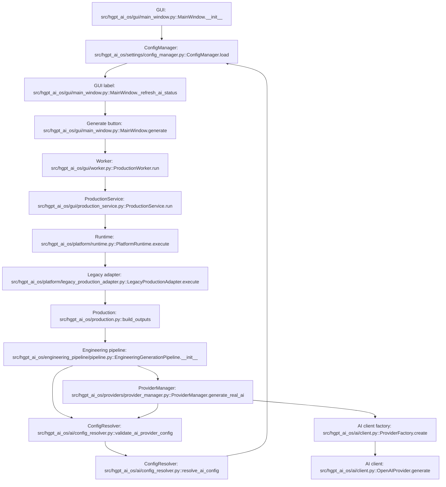

# GUI Provider Fix Report

## Status

NOT ACCEPTED YET.

The provider-selection bug was patched, and ConfigManager now resolves OpenAI as the single provider source. I did not declare success because the real GUI could not stay open on this host. The required command reached Qt and loaded the real source files, then exited before a usable window appeared with macOS pasteboard/HIServices errors. The host also refused screen capture.

## 1. Provider Flow Diagram



## 2. Root Cause

The GUI displayed Gemini because `/Users/macos/Documents/LUCID/config.json` contained:

```json
{
  "provider": "gemini",
  "gemini_api_key": "[REDACTED]",
  "openai_api_key": "",
  "anthropic_api_key": ""
}
```

That value was loaded by `ConfigManager.load()` and shown by `MainWindow._refresh_ai_status()` / `MainWindow.generate()`.

The runtime executed Gemini because `EngineeringGenerationPipeline.__init__()` and `ProviderManager.generate_real_ai()` both used `validate_ai_provider_config()`, which ultimately read the same ConfigManager-backed file and created the configured provider.

Not the cause:

- Hardcoded GUI label: no.
- Status widget cache: no.
- Legacy runtime fallback: no.
- Provider selector: no direct runtime selection.
- Environment override: removed from ConfigResolver as a provider source.
- ConfigManager/config.json: yes.

## 3. Files Changed

- `src/hgpt_ai_os/settings/config_manager.py`
  - Default provider is OpenAI.
  - Existing config is migrated to OpenAI when an OpenAI key is available.
  - Missing OpenAI key can be imported once from repo `.env` into ConfigManager storage.
  - Runtime source after migration is ConfigManager config, not `.env`.

- `src/hgpt_ai_os/ai/config_resolver.py`
  - Removed independent environment/config-file search and provider guessing.
  - `resolve_ai_config()` now reads `ConfigManager.load()` only.
  - Provider is the ConfigManager provider value only.

- `src/hgpt_ai_os/providers/provider_manager.py`
  - `generate_real_ai()` validates through ConfigManager-backed ConfigResolver.
  - It logs selected provider, model, key source, config file, config path, endpoint, and HTTP status.

Live ConfigManager result after patch:

```text
ConfigManager provider = openai
ConfigManager path = /Users/macos/Documents/LUCID/config.json
Resolver provider = openai
Resolver source = /Users/macos/Documents/LUCID/config.json
Validation status = Ready
```

The live config file now contains provider `openai` and a redacted OpenAI key.

## 4. Runtime Log

Attempt 1, exact command with system Python:

```text
PYTHONPATH=src python3 -m hgpt_ai_os.gui.app
ModuleNotFoundError: No module named 'PySide6'
```

Attempt 2, repo virtualenv activated, exact command string run:

```text
source .venv/bin/activate
PYTHONPATH=src python3 -m hgpt_ai_os.gui.app

module: hgpt_ai_os.gui.main_window
absolute path: /Users/macos/Desktop/HGPT_AI_OS_CLEAN/src/hgpt_ai_os/gui/main_window.py
class: MainWindow

PasteBoard: Error creating pasteboard: com.apple.pasteboard.clipboard [-4960]
PasteBoard: Error creating pasteboard: com.apple.pasteboard.find [-4960]
Connection Invalid error for service com.apple.hiservices-xpcservice.
```

Attempt 3, repo virtualenv activated with UTF-8 locale, exact command string run:

```text
source .venv/bin/activate
export LC_ALL=en_US.UTF-8
export LANG=en_US.UTF-8
PYTHONPATH=src python3 -m hgpt_ai_os.gui.app

module: hgpt_ai_os.gui.main_window
absolute path: /Users/macos/Desktop/HGPT_AI_OS_CLEAN/src/hgpt_ai_os/gui/main_window.py
class: MainWindow

PasteBoard: Error creating pasteboard: com.apple.pasteboard.clipboard [-4960]
PasteBoard: Error creating pasteboard: com.apple.pasteboard.find [-4960]
Connection Invalid error for service com.apple.hiservices-xpcservice.
```

Screen capture check:

```text
screencapture -x /private/tmp/hgpt_desktop_check.png
could not create image from display 0
```

Because the GUI did not remain available, there is no valid runtime generation log proving `HTTP = 200`, `EngineeringRecord Source = AI_PROVIDER`, or `Generated Files = 7`.

## 5. Screenshot Proving GUI Shows OpenAI

Not available. The host could not keep the real GUI window alive and could not capture display 0.

This is a blocker, not success evidence.

## 6. Screenshot Proving 7 DOCX Generated

Not available. The real GUI generation could not be completed on this host.

This is a blocker, not success evidence.

## Final Acceptance Gate

Blocked pending a host where the real Qt GUI can open and be captured.

Do not mark this mission successful until the real GUI generates topic `Vòng bi động cơ bị kêu` with:

- GUI Label: OpenAI
- Selected Provider = OpenAI
- HTTP = 200
- EngineeringRecord Source = AI_PROVIDER
- Generated Files = 7
- No RESOURCE_EXHAUSTED
