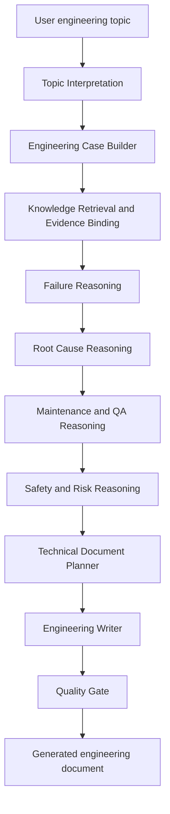

# LUCID Knowledge Engine V2 Redesign

Status: Architecture only. No implementation in this document.

Scope: Redesign `topic_engine`, writers, and knowledge reasoning so LUCID behaves as an Engineering Knowledge System instead of a marketing content generator.

Non-scope: GUI, runtime, production pipeline, platform layer, DOCX export, PyInstaller, desktop packaging, AI provider routing, and folder structure.

---

## 1. Executive Architecture

LUCID Knowledge Engine V2 must generate documents that read like work from a chief engineer, OEM technical specialist, failure analysis expert, maintenance consultant, and QA/QC manager. The engine must not start from channel templates or marketing hooks. It must start from engineering interpretation, build a diagnostic reasoning model, prove each root cause with inspection and measurement logic, then render a technical document from that reasoning object.

The core redesign is:

1. Convert the user topic into a structured engineering case.
2. Build a failure and maintenance reasoning model.
3. Expand possible root causes into evidence-driven diagnostic branches.
4. Produce a fixed engineering document structure for engineering topics.
5. Enforce writer quality gates before the text is returned to existing downstream surfaces.

V2 keeps the external product contract stable. Existing callers still ask the topic engine for generated output. Internally, the topic engine stops acting as a content planner and becomes a knowledge synthesis pipeline.

---

## 2. Design Principles

### 2.1 Engineering first

Every paragraph must answer at least one engineering question:

- What physical, electrical, mechanical, process, quality, safety, or maintenance condition is involved?
- What evidence would confirm or reject the statement?
- What standard, acceptance limit, procedure, or operating condition controls the decision?
- What action prevents recurrence?

If a paragraph cannot pass this test, it must not be generated.

### 2.2 Reasoning before writing

Writers must not invent the analysis while writing. They receive a complete `EngineeringCase` that already contains failure modes, mechanisms, possible root causes, measurements, acceptance criteria, standards, repair logic, verification logic, preventive actions, and lessons learned.

### 2.3 Root-cause accountability

Every root cause must be represented as a diagnostic object with:

- Symptoms
- Inspection
- Measurement
- Decision
- Corrective Action
- Preventive Action

The final document must not list root causes without proving how a technician or engineer would confirm them.

### 2.4 No generic text

The engine must reject generic language such as "improve quality", "check carefully", "perform maintenance regularly", or "follow safety rules" unless it is tied to a concrete asset, parameter, inspection point, failure mechanism, acceptance criterion, or control method.

### 2.5 Stable external boundaries

The redesign is internal to topic reasoning and writers. Existing GUI, runtime, production, export, desktop, provider, and packaging contracts remain unchanged.

---

## 3. Current State Summary

The current engine already has useful foundations:

- `TopicContext` carries domain, intent, entities, failures, severity, standards, knowledge query, and playbook key.
- `TopicContextBuilder` extracts entities, failures, intent, severity, standards, playbook selection, and failure intelligence.
- `ReasoningEngine` creates a `ReasoningObject` with decision, mechanisms, evidence, corrective actions, preventive actions, controls, and verification.
- Writer modules render output per channel.

The redesign should evolve these concepts rather than replacing the product boundary. The V2 shift is from profile/playbook-assisted content to diagnostic knowledge synthesis.

---

## 4. Target Pipeline

### 4.1 High-level flow



### 4.2 Detailed stages

#### Stage 1: Topic Interpretation

Input: raw user topic.

Output: `TopicContextV2`.

Responsibilities:

- Identify asset, component, subsystem, process, material, defect, failure symptom, operating condition, production context, severity, and standards.
- Determine whether the topic is an engineering topic.
- Normalize Vietnamese and English technical terms without losing domain meaning.
- Create a retrieval query for knowledge search.
- Preserve the original user topic for traceability.

#### Stage 2: Engineering Case Builder

Input: `TopicContextV2`.

Output: `EngineeringCase`.

Responsibilities:

- Convert topic entities into an engineering case frame.
- Define the system boundary.
- Define the normal working principle.
- Define the abnormal condition.
- Identify affected functions, risks, and expected evidence.

#### Stage 3: Knowledge Retrieval and Evidence Binding

Input: `EngineeringCase`.

Output: `EvidencePack`.

Responsibilities:

- Retrieve relevant internal knowledge.
- Bind standards, maintenance practices, inspection methods, OEM-style checks, QA/QC acceptance rules, and prior lessons to the case.
- Mark evidence source type: standard, maintenance history, failure library, checklist, OEM guidance, internal lesson, or engineering rule.
- Reject weak evidence that does not support the topic.

#### Stage 4: Failure Reasoning

Input: `EngineeringCase` plus `EvidencePack`.

Output: `FailureAnalysis`.

Responsibilities:

- Define the observed failure mode.
- Explain the failure mechanism using physics, mechanics, electricity, materials, process control, or quality logic.
- Connect symptoms to mechanism.
- Describe how the failure develops over time.
- Separate immediate cause, contributing cause, hidden cause, and systemic cause.

#### Stage 5: Root Cause Reasoning

Input: `FailureAnalysis`.

Output: tuple of `RootCauseAnalysis`.

Responsibilities:

- Generate possible root causes.
- For each root cause, provide symptoms, inspection, measurement, decision logic, corrective action, and preventive action.
- Build the 5 Why chain.
- Build the fault tree.
- Rank root causes by likelihood, severity, detectability, and evidence strength.

#### Stage 6: Maintenance and QA Reasoning

Input: `RootCauseAnalysis`.

Output: `ControlPlan`.

Responsibilities:

- Define inspection procedure.
- Define measurement method.
- Define acceptance criteria.
- Define repair procedure.
- Define verification after repair.
- Define preventive maintenance plan.
- Define QA hold points and release conditions.

#### Stage 7: Safety and Risk Reasoning

Input: `EngineeringCase`, `FailureAnalysis`, and `ControlPlan`.

Output: `SafetyRiskPlan`.

Responsibilities:

- Identify safety hazards during inspection, repair, testing, and return to service.
- Define lockout, isolation, PPE, lifting, hot work, electrical, rotating equipment, pressure, stored energy, or confined-space controls when applicable.
- Prevent unsafe recommendations.

#### Stage 8: Technical Document Planning

Input: complete reasoning model.

Output: `KnowledgeDocumentPlan`.

Responsibilities:

- Map reasoning fields into the fixed 20-section engineering structure.
- Ensure no required section is empty for engineering topics.
- Ensure every root cause is represented with the required diagnostic fields.
- Ensure sections are ordered for professional engineering review.

#### Stage 9: Engineering Writer

Input: `KnowledgeDocumentPlan`.

Output: document text.

Responsibilities:

- Write in engineering language.
- Avoid marketing tone, filler, duplicated sentences, and generic claims.
- Use specific inspection points, measurements, limits, risks, actions, and standards.
- Keep paragraph purpose clear.

#### Stage 10: Quality Gate

Input: document text plus reasoning model.

Output: accepted document or structured rejection.

Responsibilities:

- Verify the 20 required sections exist.
- Verify every root cause has all required diagnostic fields.
- Detect repeated sentences.
- Detect generic filler.
- Detect missing measurement and acceptance logic.
- Detect marketing tone.
- Detect unsupported standards or invented acceptance criteria.

---

## 5. Required Output Structure

Every engineering topic must produce these sections in this exact order:

1. Problem Description
2. Working Principle
3. Engineering Theory
4. Failure Mode
5. Failure Mechanism
6. Possible Root Causes
7. 5 Why Analysis
8. Fault Tree
9. Inspection Procedure
10. Measurement Method
11. Acceptance Criteria
12. Applicable Standards
13. Repair Procedure
14. Verification after Repair
15. Preventive Actions
16. Maintenance Plan
17. Lessons Learned
18. Common Mistakes
19. Kaizen Opportunities
20. Digital Factory Recommendations

### Section intent

#### 1. Problem Description

Define the asset, component, process, symptom, abnormal condition, impact, and urgency. This section must state what is happening, where it happens, when it appears, and why it matters.

#### 2. Working Principle

Explain how the equipment, process, or system should normally work. This must include the normal energy path, material path, signal path, load path, control path, or quality-control path when applicable.

#### 3. Engineering Theory

Explain the engineering theory that controls the topic: load, stress, wear, heat, corrosion, lubrication, vibration, electrical resistance, fluid flow, welding metallurgy, process capability, tolerance stack-up, or another relevant principle.

#### 4. Failure Mode

Describe the observable failure condition in engineering terms. The failure mode must be more specific than "not working" or "bad quality".

#### 5. Failure Mechanism

Explain how the failure develops. This section must connect operating condition, physical mechanism, process drift, human factor, or control weakness to the final failure mode.

#### 6. Possible Root Causes

List possible root causes as diagnostic branches. Each branch must include symptoms, inspection, measurement, decision, corrective action, and preventive action.

#### 7. 5 Why Analysis

Provide a cause chain from symptom to systemic cause. The chain must not stop at operator error unless the control system, training system, maintenance system, or QA system failure is also identified.

#### 8. Fault Tree

Represent the failure as top event, intermediate events, and basic events. The tree must separate equipment causes, process causes, material causes, human causes, environment causes, and management-system causes when relevant.

#### 9. Inspection Procedure

Define the step-by-step inspection sequence. Include safety preparation, visual check, functional check, disassembly check if needed, data collection, and evidence recording.

#### 10. Measurement Method

Define what to measure, where to measure, which tool or method to use, how to record the data, and which condition must be controlled during measurement.

#### 11. Acceptance Criteria

Define pass/fail criteria. If exact numeric limits are not available from the topic or knowledge base, state the required source of truth, such as OEM manual, approved drawing, WPS, ITP, calibration requirement, maintenance standard, or internal specification.

#### 12. Applicable Standards

List applicable standards, specifications, OEM documents, inspection plans, safety requirements, or internal procedures. Do not invent standard numbers unless retrieved or clearly known from approved knowledge.

#### 13. Repair Procedure

Define the repair sequence, including isolation, removal, cleaning, adjustment, replacement, reassembly, parameter setting, and documentation.

#### 14. Verification after Repair

Define how to prove the repair worked. Include retest method, measurement evidence, load test or functional test, QA witness point, and release condition.

#### 15. Preventive Actions

Define actions that prevent recurrence. These must be linked to root causes, not generic reminders.

#### 16. Maintenance Plan

Define inspection frequency, maintenance tasks, condition-monitoring indicators, spare parts, responsible role, and escalation trigger.

#### 17. Lessons Learned

Capture engineering learning that can be reused on future jobs. This must convert the case into a rule, checklist point, design review point, maintenance control, or QA hold point.

#### 18. Common Mistakes

List mistakes that engineers, technicians, maintenance teams, QA inspectors, or operators commonly make when diagnosing or repairing this issue.

#### 19. Kaizen Opportunities

Suggest practical improvements to reduce recurrence, inspection time, repair time, ambiguity, waiting time, rework, or variation.

#### 20. Digital Factory Recommendations

Recommend digital controls such as sensor tracking, maintenance logs, QR inspection records, SPC charts, failure dashboards, CMMS triggers, digital checklists, photo evidence, calibration reminders, or predictive maintenance signals.

---

## 6. Root Cause Diagnostic Contract

Every root cause must be modeled and rendered with this structure:

```text
Root Cause:
Symptoms:
Inspection:
Measurement:
Decision:
Corrective Action:
Preventive Action:
```

### Root-cause object requirements

- `root_cause`: specific cause, not a broad category.
- `cause_type`: equipment, process, material, human, environment, design, maintenance, QA, supplier, or management system.
- `symptoms`: observable evidence that suggests this cause.
- `inspection`: physical or procedural check needed to confirm the cause.
- `measurement`: parameter, method, instrument, location, and data record.
- `decision`: pass/fail logic or decision rule.
- `corrective_action`: action that removes the cause from the current case.
- `preventive_action`: control that prevents recurrence.
- `risk_if_ignored`: consequence if the cause is not corrected.
- `confidence`: confidence level based on evidence strength.

### Example shape

```text
Root Cause: Bearing lubrication film breakdown due to wrong grease interval.
Symptoms: Bearing housing temperature rises during load, noise increases after warm-up, grease appears dark or contaminated.
Inspection: Check lubrication record, inspect grease condition, rotate shaft by hand after isolation, inspect seal condition.
Measurement: Measure bearing housing temperature, vibration velocity, axial/radial play, and compare with OEM or internal maintenance limits.
Decision: Confirm this cause if temperature and vibration trend rise together and grease condition or lubrication record is abnormal.
Corrective Action: Clean bearing housing, replace bearing if damaged, apply approved grease type and quantity, restore seal condition.
Preventive Action: Add lubrication interval to CMMS, require grease type verification, trend temperature/vibration after each service.
```

---

## 7. Core Data Model

### 7.1 TopicContextV2

Purpose: normalized interpretation of the topic.

Fields:

- `original_topic`
- `language`
- `domain`
- `intent`
- `asset`
- `equipment`
- `subsystem`
- `component`
- `process`
- `material`
- `symptom`
- `failure_keyword`
- `operating_condition`
- `production_context`
- `severity`
- `safety_risk`
- `quality_risk`
- `standards`
- `knowledge_query`
- `confidence`
- `signals`

### 7.2 EngineeringCase

Purpose: structured case before reasoning.

Fields:

- `case_id`
- `topic_context`
- `system_boundary`
- `normal_function`
- `abnormal_condition`
- `affected_function`
- `operating_context`
- `engineering_parameters`
- `known_constraints`
- `required_evidence`
- `assumptions`

### 7.3 EvidencePack

Purpose: retrieved and inferred knowledge used by reasoning.

Fields:

- `standards`
- `inspection_methods`
- `measurement_methods`
- `acceptance_sources`
- `maintenance_rules`
- `failure_library_entries`
- `lessons_learned`
- `safety_controls`
- `qa_hold_points`
- `evidence_strength`

### 7.4 FailureAnalysis

Purpose: explanation of failure mode and mechanism.

Fields:

- `failure_mode`
- `failure_mechanism`
- `mechanism_chain`
- `symptom_map`
- `immediate_causes`
- `contributing_causes`
- `hidden_causes`
- `systemic_causes`
- `risk_consequence`

### 7.5 RootCauseAnalysis

Purpose: diagnostic branch for one root cause.

Fields:

- `root_cause`
- `cause_type`
- `symptoms`
- `inspection`
- `measurement`
- `decision`
- `corrective_action`
- `preventive_action`
- `risk_if_ignored`
- `confidence`
- `related_standard`
- `verification_required`

### 7.6 FiveWhyAnalysis

Purpose: causal chain from symptom to system fix.

Fields:

- `why_1`
- `why_2`
- `why_3`
- `why_4`
- `why_5`
- `systemic_control`
- `evidence_needed`

### 7.7 FaultTree

Purpose: structured failure logic.

Fields:

- `top_event`
- `intermediate_events`
- `basic_events`
- `and_gates`
- `or_gates`
- `critical_paths`
- `controls`

### 7.8 ControlPlan

Purpose: inspection, measurement, repair, QA, and maintenance control.

Fields:

- `inspection_procedure`
- `measurement_method`
- `acceptance_criteria`
- `applicable_standards`
- `repair_procedure`
- `verification_after_repair`
- `preventive_actions`
- `maintenance_plan`
- `qa_release_conditions`

### 7.9 KnowledgeDocumentPlan

Purpose: final structure passed to writers.

Fields:

- `sections`
- `root_cause_blocks`
- `required_terms`
- `forbidden_terms`
- `standards_notes`
- `quality_constraints`
- `traceability`

---

## 8. Class Diagram

```mermaid
classDiagram
    class KnowledgeEngineV2 {
        +generate(topic, channel)
        -interpret_topic(topic)
        -build_case(context)
        -bind_evidence(case)
        -reason(case, evidence)
        -plan_document(reasoning)
        -write(plan)
        -quality_check(document, plan)
    }

    class TopicInterpreter {
        +interpret(topic) TopicContextV2
    }

    class EngineeringCaseBuilder {
        +build(context) EngineeringCase
    }

    class EvidenceBinder {
        +bind(case) EvidencePack
    }

    class FailureReasoner {
        +analyze(case, evidence) FailureAnalysis
    }

    class RootCauseReasoner {
        +analyze(failure, evidence) RootCauseAnalysis[]
        +build_five_why(root_causes) FiveWhyAnalysis
        +build_fault_tree(root_causes) FaultTree
    }

    class MaintenanceReasoner {
        +build_control_plan(case, failure, root_causes) ControlPlan
    }

    class SafetyReasoner {
        +apply_safety_controls(case, control_plan) SafetyRiskPlan
    }

    class KnowledgeDocumentPlanner {
        +plan(reasoning_bundle) KnowledgeDocumentPlan
    }

    class EngineeringWriter {
        +write(plan) string
    }

    class KnowledgeQualityGate {
        +validate(document, plan) QualityReport
    }

    class TopicContextV2
    class EngineeringCase
    class EvidencePack
    class FailureAnalysis
    class RootCauseAnalysis
    class ControlPlan
    class KnowledgeDocumentPlan
    class QualityReport

    KnowledgeEngineV2 --> TopicInterpreter
    KnowledgeEngineV2 --> EngineeringCaseBuilder
    KnowledgeEngineV2 --> EvidenceBinder
    KnowledgeEngineV2 --> FailureReasoner
    KnowledgeEngineV2 --> RootCauseReasoner
    KnowledgeEngineV2 --> MaintenanceReasoner
    KnowledgeEngineV2 --> SafetyReasoner
    KnowledgeEngineV2 --> KnowledgeDocumentPlanner
    KnowledgeEngineV2 --> EngineeringWriter
    KnowledgeEngineV2 --> KnowledgeQualityGate

    TopicInterpreter --> TopicContextV2
    EngineeringCaseBuilder --> EngineeringCase
    EvidenceBinder --> EvidencePack
    FailureReasoner --> FailureAnalysis
    RootCauseReasoner --> RootCauseAnalysis
    MaintenanceReasoner --> ControlPlan
    KnowledgeDocumentPlanner --> KnowledgeDocumentPlan
    KnowledgeQualityGate --> QualityReport
```



---

## 9. Writer Architecture

### 9.1 Writer role

The writer is not the reasoning engine. The writer converts approved reasoning into professional engineering prose.

Writer input:

- `KnowledgeDocumentPlan`
- `EngineeringCase`
- `FailureAnalysis`
- root-cause diagnostic objects
- `ControlPlan`
- `SafetyRiskPlan`
- quality constraints

Writer output:

- fixed 20-section engineering document
- no marketing hook
- no CTA
- no filler
- no repeated sentence
- no unsupported standard claim

### 9.2 Writer rules

The writer must:

- Use engineering nouns and verbs.
- Prefer inspection, measurement, decision, control, verification, and recurrence prevention language.
- Keep each paragraph tied to evidence or action.
- Convert broad statements into specific checks.
- Explain cause-effect logic.
- Make uncertainty explicit when data is missing.

The writer must not:

- Use social-media structure.
- Use "hook", "CTA", "viral", "engaging", "audience", or marketing framing.
- Repeat the same recommendation in multiple sections.
- Claim exact acceptance values without evidence.
- Hide missing standards behind generic language.
- Blame operators without naming the failed control.

### 9.3 Document rendering policy

For engineering topics, the writer always renders the fixed 20-section structure. Existing channel-specific writers may remain for non-engineering outputs, but engineering topics must route to the engineering document writer.

---

## 10. Knowledge Reasoning Architecture

### 10.1 Engineering reasoning

Engineering reasoning explains:

- normal function
- abnormal function
- load path or process path
- critical parameters
- physics or process theory
- inspection evidence
- acceptance logic

### 10.2 Failure reasoning

Failure reasoning explains:

- failure mode
- mechanism
- symptom progression
- immediate cause
- hidden cause
- systemic cause
- risk if not corrected

### 10.3 Maintenance reasoning

Maintenance reasoning explains:

- inspection frequency
- wear or degradation indicators
- lubrication, alignment, calibration, cleaning, replacement, adjustment, or condition monitoring requirements
- spare parts and escalation triggers
- CMMS or maintenance-record controls

### 10.4 QA reasoning

QA reasoning explains:

- inspection hold points
- witness points
- pass/fail criteria
- nonconformance triggers
- evidence records
- release conditions

### 10.5 Safety reasoning

Safety reasoning explains:

- hazards during inspection and repair
- required isolation
- PPE
- stored energy
- hot work, lifting, electrical, rotating equipment, pressure, or chemical controls
- safe return-to-service condition

---

## 11. Quality Gate

The quality gate must validate both structure and technical value.

### 11.1 Required checks

- All 20 sections are present and non-empty.
- Root causes include symptoms, inspection, measurement, decision, corrective action, and preventive action.
- No repeated sentences.
- No section uses only generic advice.
- Measurement Method includes tool, parameter, location, and record expectation when applicable.
- Acceptance Criteria cites a source of truth or clearly states that the source must come from OEM/manual/drawing/WPS/ITP/internal specification.
- Applicable Standards does not invent standards.
- Repair Procedure includes verification linkage.
- Preventive Actions map back to root causes.
- Maintenance Plan includes frequency or trigger logic.
- Digital Factory Recommendations are practical and tied to data capture or control.

### 11.2 Rejection examples

Reject:

- "Check the machine carefully."
- "Do regular maintenance."
- "Improve operator awareness."
- "Follow the standard."
- "Use proper tools."

Accept only if converted into engineering controls:

- "Measure radial bearing clearance at the drive-end bearing after lockout and compare with the OEM maintenance limit."
- "Add a CMMS trigger after 250 operating hours or when vibration velocity exceeds the internal alert threshold."
- "Release the machine only after no-load and load-test current are recorded and approved by maintenance and QA."

---

## 12. Migration Plan

### Phase 0: Architecture freeze

Deliverables:

- Approve this architecture.
- Confirm fixed 20-section output structure.
- Confirm root-cause diagnostic contract.
- Confirm unchanged external surfaces.

No code changes.

### Phase 1: Data model introduction

Scope:

- Add V2 reasoning data objects inside `topic_engine`.
- Keep existing public entry points stable.
- Do not change GUI, runtime, production, export, desktop, provider, packaging, or folder structure.

Validation:

- Unit tests for object completeness.
- Golden examples for 3 engineering topics.

### Phase 2: Reasoning pipeline

Scope:

- Add topic interpretation upgrade.
- Add engineering case builder.
- Add evidence binding.
- Add failure reasoner.
- Add root-cause reasoner.
- Add maintenance, QA, and safety reasoners.

Validation:

- Root causes must include all required diagnostic fields.
- Failure mechanism must be tied to symptoms and measurements.
- Acceptance criteria must cite a source of truth.

### Phase 3: Engineering document planner

Scope:

- Add `KnowledgeDocumentPlan`.
- Map reasoning model to the 20 required sections.
- Preserve external return contract.

Validation:

- Every engineering topic returns all 20 sections in order.
- Every root cause appears with required diagnostic fields.

### Phase 4: Writer redesign

Scope:

- Redesign engineering writer to render from `KnowledgeDocumentPlan`.
- Remove marketing structure from engineering outputs.
- Keep non-engineering writer behavior isolated.

Validation:

- No hook/CTA/social-media language in engineering documents.
- No repeated sentences.
- No filler.
- Each paragraph must add engineering value.

### Phase 5: Quality gate

Scope:

- Add structure, diagnostic, repetition, filler, measurement, acceptance, standard, repair, maintenance, and digital-factory checks.

Validation:

- Bad generic outputs are rejected.
- Missing root-cause fields are rejected.
- Unsupported standards are flagged.

### Phase 6: Production compatibility verification

Scope:

- Verify existing callers receive valid text.
- Verify DOCX export can consume the generated text without exporter changes.
- Verify no GUI, runtime, production, platform, desktop, provider, packaging, or PyInstaller changes were required.

Validation:

- End-to-end sample generation through current product path.
- Document text inspection for real engineering output.
- Git diff limited to approved V2 surfaces.

---

## 13. Acceptance Criteria for Knowledge Engine V2

V2 is accepted only when:

- Engineering topics produce the fixed 20-section document.
- Every root cause includes symptoms, inspection, measurement, decision, corrective action, and preventive action.
- Output reads like engineering analysis, not marketing content.
- Failure mechanism is technical and specific.
- Inspection and measurement logic are actionable.
- Acceptance criteria are traceable to standards, OEM/manual/drawing/WPS/ITP/internal requirements, or clearly marked as requiring that source.
- Repair procedure and verification are linked.
- Preventive actions and maintenance plan reduce recurrence.
- Digital factory recommendations are practical and data-driven.
- No GUI, runtime, production, platform, DOCX export, PyInstaller, desktop, AI provider, or folder-structure changes are required.

---

## 14. Final Target

LUCID Knowledge Engine V2 must behave as an engineering reasoning system:

- It understands the asset and failure context.
- It explains how the system should work.
- It explains why the system failed.
- It proves root causes through inspection and measurement.
- It defines repair and verification.
- It prevents recurrence through maintenance, QA, safety, kaizen, and digital factory controls.

The output must be useful to people who actually diagnose, repair, inspect, approve, and improve industrial systems.
