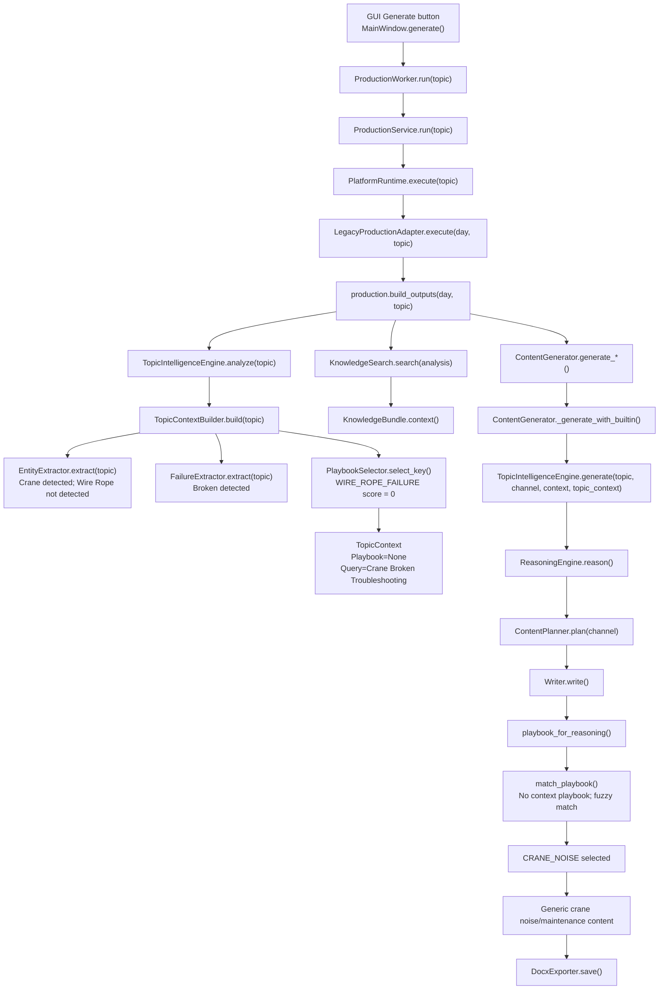

# ROOT CAUSE REPORT: Production Build Generates Generic Crane Content

Audit date: 2026-07-12
Repository: `HGPT_AI_OS_CLEAN`
Scope: forensic audit only. No source code was modified.
Observed topic: `Cầu trục 7.5T bị đứt`

## Executive Finding

Production content becomes generic because the active production path does not classify `Cầu trục 7.5T bị đứt` as the existing `WIRE_ROPE_FAILURE` case.

The topic is reduced to:

```text
Input topic:
Cầu trục 7.5T bị đứt

TopicContext:
Equipment: Crane
Failures: Broken
Components: None
Playbook: None
Knowledge Query: Crane Broken Troubleshooting

Writer playbook match:
CRANE_NOISE

Generated content:
Chẩn đoán tiếng ồn cầu trục / ray / bánh xe / hộp giảm tốc / phanh
```

The exact failure chain is:

1. `src/hgpt_ai_os/topic_engine/topic_intelligence_profiles.json:17-31` defines `Wire Rope` only when the topic contains aliases such as `cáp`, `cáp tải`, `cáp cẩu`, or `cáp cẩu trục`.
2. The observed topic contains `Cầu trục` and `đứt`, but does not contain `cáp`.
3. `src/hgpt_ai_os/topic_engine/topic_intelligence_profiles.json:633-647` detects only failure `Broken`.
4. `src/hgpt_ai_os/topic_engine/topic_intelligence_profiles.json:1427-1438` requires both `Crane` and `Wire Rope` to select `WIRE_ROPE_FAILURE`.
5. `src/hgpt_ai_os/topic_engine/topic_intelligence_engine.py:270-273` returns score `0` for a playbook when any expected match group is missing.
6. `TopicContext.playbook_key` becomes empty.
7. `src/hgpt_ai_os/topic_engine/writers/channel_writer.py:435-470` falls back to fuzzy playbook scoring.
8. `src/hgpt_ai_os/topic_engine/writers/channel_writer.py:453-460` gives token credit for partial alias tokens.
9. `src/hgpt_ai_os/topic_engine/writers/channel_writer.py:353-368` contains the hard-coded `CRANE_NOISE` playbook, which shares `cau truc` tokens and is selected.

## Mermaid Flowchart



## Complete Execution Flow Evidence

| Step | File | Function | Purpose | Input | Output |
|---|---|---|---|---|---|
| 1 | `src/hgpt_ai_os/gui/main_window.py:709` | `MainWindow.generate` | Starts production when the GUI button/shortcut is used. | Current text from `self.topic`. | Starts `ProductionWorker(topic)` at lines `770-776`. |
| 2 | `src/hgpt_ai_os/gui/worker.py:54` | `ProductionWorker.run` | Runs production in a Qt thread and redirects stdout/stderr to GUI logs. | `self.topic`. | Emits `ProductionResult` from `ProductionService.run`. |
| 3 | `src/hgpt_ai_os/gui/production_service.py:15` | `ProductionService.run` | Calls platform runtime. | `topic`. | `ProductionResult` from `PlatformRuntime.execute`. |
| 4 | `src/hgpt_ai_os/platform/runtime.py:105` | `PlatformRuntime.execute` | Uses registered legacy production adapter. | `topic`, `open_output_folder`, metadata providers. | `ProductionResult` with DOCX file paths. |
| 5 | `src/hgpt_ai_os/platform/legacy_production_adapter.py:14` | `LegacyProductionAdapter.execute` | Delegates to old production pipeline. | `day`, `topic`. | Path from `production.build_outputs`. |
| 6 | `src/hgpt_ai_os/production.py:26` | `build_outputs` | Main active production pipeline. | `day`, `topic`, `open_output_folder`. | Output directory path. |
| 7 | `src/hgpt_ai_os/topic_engine/__init__.py:45` | `TopicIntelligenceEngine.analyze` | Builds `TopicContext`. | Raw topic. | `TopicContext`. |
| 8 | `src/hgpt_ai_os/topic_engine/topic_intelligence_engine.py:289` | `TopicContextBuilder.build` | Extracts entities, failures, intent, severity, playbook, failure intelligence, and knowledge query. | Raw topic. | `TopicContext`. |
| 9 | `src/hgpt_ai_os/topic_engine/topic_intelligence_engine.py:72` | `EntityExtractor.extract` | Combines dictionary extractor and JSON profile entities. | Raw topic. | Entity buckets and signals. |
| 10 | `src/hgpt_ai_os/topic_engine/entity_extractor.py:68` | `EngineeringEntityExtractor.extract` | Detects engineering concepts from topic parser output. | `ParsedTopic`. | `EntityExtraction`. |
| 11 | `src/hgpt_ai_os/topic_engine/topic_intelligence_engine.py:141` | `FailureExtractor.extract` | Detects failure aliases. | Raw topic. | Failure tuple and severity tuple. |
| 12 | `src/hgpt_ai_os/topic_engine/topic_intelligence_engine.py:162` | `IntentDetectorV2.detect` | Chooses intent; returns troubleshooting when failures exist. | Topic and failures. | Intent, confidence, signals. |
| 13 | `src/hgpt_ai_os/topic_engine/topic_intelligence_engine.py:198` | `SeverityDetector.detect` | Chooses severity from failure and rule matches. | Entities, failures, failure severities. | Severity string. |
| 14 | `src/hgpt_ai_os/topic_engine/topic_intelligence_engine.py:248` | `PlaybookSelector.select_key` | Scores JSON playbooks. | Entities and failures. | Playbook key or empty string. |
| 15 | `src/hgpt_ai_os/topic_engine/topic_intelligence_engine.py:232` | `KnowledgePlanner.plan` | Builds knowledge query from equipment, components, failures, intent. | `TopicContext`. | Query string. |
| 16 | `src/hgpt_ai_os/topic_engine/topic_context.py:31` | `TopicContext.to_topic_analysis` | Converts context to legacy knowledge search shape. | `TopicContext`. | `TopicAnalysis`. |
| 17 | `src/hgpt_ai_os/intelligence/knowledge_search.py:14` | `KnowledgeSearch.search` | Retrieves and thresholds knowledge packages. | `TopicAnalysis`. | List of `KnowledgeResult`. |
| 18 | `src/hgpt_ai_os/knowledge/retrieval_pipeline.py:35` | `KnowledgeRetrievalPipeline.scored_candidates` | Lists packages and ranks them. | Topic or analysis. | Ranked candidates. |
| 19 | `src/hgpt_ai_os/knowledge/bundle.py:18` | `KnowledgeBundle.context` | Converts retrieved packages into reference notes. | Query and items. | Context string. |
| 20 | `src/hgpt_ai_os/content/generator.py:356` | `ContentGenerator.__init__` | Determines AI/free mode and creates topic engine/classifiers. | Optional AI instance. | Generator instance. |
| 21 | `src/hgpt_ai_os/content/generator.py:382` | `prime_topic_context` | Stores the analyzed context from production. | `TopicContext`. | Internal `_topic_context`. |
| 22 | `src/hgpt_ai_os/content/generator.py:391` | `generate` | Normalizes channel, builds prompt, chooses AI or built-in path. | Platform, topic, context. | Final content string. |
| 23 | `src/hgpt_ai_os/content/generator.py:560` | `_generate_with_builtin` | Routes offline/free or AI-fallback generation. | `GenerationSpec`, topic, context, topic context. | Built-in content string. |
| 24 | `src/hgpt_ai_os/topic_engine/__init__.py:79` | `TopicIntelligenceEngine.generate` | Runs reason-plan-write. | Topic, channel, context, optional topic context. | Writer output. |
| 25 | `src/hgpt_ai_os/topic_engine/__init__.py:48` | `TopicIntelligenceEngine.reason` | Builds reasoning object from parsed topic, merged entities, problem, facts. | Topic, context, topic context. | `ReasoningObject`. |
| 26 | `src/hgpt_ai_os/topic_engine/content_planner.py:27` | `ContentPlanner.plan` | Normalizes channel and creates section plan. | `ReasoningObject`, channel. | `ContentPlan`. |
| 27 | `src/hgpt_ai_os/topic_engine/writers/facebook_writer.py:17` | `FacebookWriter.write` | Writes Facebook content using selected playbook. | Reasoning and plan. | Content text. |
| 28 | `src/hgpt_ai_os/topic_engine/writers/channel_writer.py:473` | `playbook_for_reasoning` | Gets matching playbook or fallback. | `ReasoningObject`. | `DomainPlaybook`. |
| 29 | `src/hgpt_ai_os/topic_engine/writers/channel_writer.py:435` | `match_playbook` | Selects context playbook or fuzzy hard-coded playbook. | Topic and reasoning. | `DomainPlaybook` or fallback. |
| 30 | `src/hgpt_ai_os/content/export/docx_exporter.py:35` | `DocxExporter.save` | Validates and writes DOCX. | Path, title, content. | `.docx` file. |

## Runtime Diagnostic Evidence

Command used: in-memory Python snippet with `PYTHONPATH=src`; it called analyzer and generator functions only. It did not call `build_outputs()` and did not write DOCX files.

Observed analyzer output:

```text
TopicContext:
- Domain: Industrial Maintenance
- Intent: Troubleshooting
- Equipment: Crane
- Components: None
- Processes: None
- Failures: Broken
- Severity: Critical
- Standards: None
- Failure Mode: None
- Playbook: None
- Knowledge Query: Crane Broken Troubleshooting
- Confidence: 0.85
entities= {'Machine': ('Crane',), 'Equipment': ('Crane',), 'Failure': ('Broken',)}
failures= ('Broken',)
signals= ('Crane', 'Broken', 'bị', 'bi')
```

Observed generated Facebook opening:

```text
Tại Chẩn đoán tiếng ồn cầu trục, hiện tượng này ảnh hưởng trực tiếp đến cầu trục, bánh xe, ray, hộp giảm tốc, phanh và cáp tải.
...
Dấu hiệu cần kiểm tra
- cầu trục kêu khi di chuyển
- rung trên dầm
- bánh xe mòn lệch
- phanh phát tiếng bất thường
```

This confirms the active output is the `CRANE_NOISE` playbook, not `WIRE_ROPE_FAILURE`.

## Exact Topic Mutation / Loss Points

### Point 1: Component is not recognized

`src/hgpt_ai_os/topic_engine/topic_intelligence_profiles.json:17-31`:

```text
Wire Rope aliases: wire rope, rope, cáp, cap, cáp tải, cap tai, cáp cẩu, cap cau, cáp cẩu trục, cap cau truc
```

The observed topic `Cầu trục 7.5T bị đứt` does not contain any of those wire-rope aliases.

### Point 2: Failure is recognized only as generic `Broken`

`src/hgpt_ai_os/topic_engine/topic_intelligence_profiles.json:633-647` maps `đứt`, `dut`, `bị đứt`, `bi dut` to canonical failure `Broken`.

Result:

```text
Crane + Broken
not
Crane + Wire Rope + Broken
```

### Point 3: Wire-rope playbook requires missing component

`src/hgpt_ai_os/topic_engine/topic_intelligence_profiles.json:1427-1438`:

```json
"key": "WIRE_ROPE_FAILURE",
"match": {
  "equipment": ["Crane"],
  "components": ["Wire Rope"]
}
```

`src/hgpt_ai_os/topic_engine/topic_intelligence_engine.py:270-273`:

```python
if expected and hits == 0:
    return 0
```

Because `Wire Rope` is absent, `WIRE_ROPE_FAILURE` scores `0`.

### Point 4: Knowledge query drops the physical failure object

`src/hgpt_ai_os/topic_engine/topic_intelligence_engine.py:231-241` builds the query from context equipment, components, materials, processes, failures, and intent.

Runtime output:

```text
Knowledge Query: Crane Broken Troubleshooting
```

Expected wire-rope case in tests:

`tests/test_topic_engine.py:148-157` expects `Cáp cẩu trục bị đứt` to produce:

```text
components: ("Wire Rope",)
playbook_key: "WIRE_ROPE_FAILURE"
query: "Crane Wire Rope Broken Troubleshooting"
```

The production topic omits the token that test case depends on.

### Point 5: Fuzzy writer matcher selects wrong crane playbook

`src/hgpt_ai_os/topic_engine/writers/channel_writer.py:453-470` scores hard-coded playbooks. When no positive context playbook exists, it returns the best positive score.

`src/hgpt_ai_os/topic_engine/writers/channel_writer.py:459-460` gives partial token credit:

```python
score += sum(1 for token in normalized_alias.split() if token in haystack)
```

`src/hgpt_ai_os/topic_engine/writers/channel_writer.py:353-368` defines `CRANE_NOISE` with aliases and content around `cau truc`, `ray`, `bánh xe`, `hộp giảm tốc`, `phanh`, and `cáp tải`.

This is the exact line-level mechanism that converts the topic into crane-noise maintenance content.

## Fallback Logic Inventory

| File | Lines | Fallback | Effect |
|---|---:|---|---|
| `src/hgpt_ai_os/gui/main_window.py` | `709-724` | Empty topic returns before production. | No content generated. |
| `src/hgpt_ai_os/gui/main_window.py` | `726-753` | Invalid config prompts settings and returns if unresolved. | No content generated. |
| `src/hgpt_ai_os/gui/worker.py` | `66-71` | Catches production exception and emits failed result. | GUI shows production failed. |
| `src/hgpt_ai_os/gui/production_service.py` | `33-42` | Knowledge count parse failure becomes `None`. | Metadata only. |
| `src/hgpt_ai_os/platform/runtime.py` | `112-115` | Registry lookup defaults to `LegacyProductionAdapter`. | Always uses legacy production pipeline. |
| `src/hgpt_ai_os/production.py` | `54-55` | Empty knowledge prints `continuing normally`. | Generation continues without retrieved knowledge. |
| `src/hgpt_ai_os/production.py` | `64-68` | Free desktop mode reports built-in/AI disabled. | Built-in generation path. |
| `src/hgpt_ai_os/content/generator.py` | `361-371` | Free mode or AI init failure leaves `self.ai` unset. | Offline topic intelligence. |
| `src/hgpt_ai_os/content/generator.py` | `399-400` | Unknown generation key gets `_custom_spec`. | Generic prompt spec. |
| `src/hgpt_ai_os/content/generator.py` | `409-411` | Free mode or no AI calls `_generate_with_builtin`. | Built-in output. |
| `src/hgpt_ai_os/content/generator.py` | `503-536` | AI exception, `AIProviderError`, mock metadata, empty/invalid text all call `_generate_with_builtin`. | Built-in output. |
| `src/hgpt_ai_os/content/generator.py` | `441-444` | Hashtags with no topic render static template. | Template hashtags. |
| `src/hgpt_ai_os/content/generator.py` | `450-454` | Checklist with no topic renders static template. | Template checklist. |
| `src/hgpt_ai_os/content/generator.py` | `589-607` | `_builtin_fallback` returns generic local-knowledge block. | No current call sites found. |
| `src/hgpt_ai_os/content/factory/topic_aware.py` | `419` | Empty topic becomes `Cải tiến xưởng sản xuất kết cấu thép`. | Generic factory topic. |
| `src/hgpt_ai_os/content/factory/topic_aware.py` | `426-438` | Unknown topic becomes `general manufacturing`. | Generic manufacturing profile. |
| `src/hgpt_ai_os/content/factory/topic_aware.py` | `486-492` | No problem rule returns profile default problem. | Generic profile problem. |
| `src/hgpt_ai_os/content/factory/topic_aware.py` | `516-521` | Out-of-scope/general topics return engineering-scope notice. | No topic content. |
| `src/hgpt_ai_os/content/factory/builder_factory.py` | `35-38` | Unknown builder raises `ValueError`. | Hard failure. |
| `src/hgpt_ai_os/content/factory/general_domain.py` | `104` | Unknown general domain becomes `LIFESTYLE_DOMAIN`. | Generic lifestyle domain. |
| `src/hgpt_ai_os/topic_engine/topic_parser.py` | `66-67` | Stop words removed from keywords. | `bị` is removed from parsed keywords. |
| `src/hgpt_ai_os/topic_engine/topic_intelligence_engine.py` | `179-180` | Any detected failure gives `Troubleshooting`. | Generic troubleshooting intent. |
| `src/hgpt_ai_os/topic_engine/topic_intelligence_engine.py` | `182-189` | No profile intent falls back to legacy detector mapping. | Generic intent mapping. |
| `src/hgpt_ai_os/topic_engine/topic_intelligence_engine.py` | `209` | No severity score defaults `Medium`. | Generic severity. |
| `src/hgpt_ai_os/topic_engine/topic_intelligence_engine.py` | `248-254` | No playbook score returns empty key. | No failure intelligence. |
| `src/hgpt_ai_os/topic_engine/topic_intelligence_engine.py` | `356-365` | No entity domain returns `Production` or `General`. | Generic domain. |
| `src/hgpt_ai_os/topic_engine/writers/channel_writer.py` | `109-112` | No `failure_intelligence` means no context playbook. | Proceeds to fuzzy/hard-coded playbooks. |
| `src/hgpt_ai_os/topic_engine/writers/channel_writer.py` | `468-470` | If no positive score, fallback playbook; if positive partial score, best hard-coded playbook. | Wrong generic playbook possible. |
| `src/hgpt_ai_os/topic_engine/writers/channel_writer.py` | `51-106` | `_fallback_playbook` creates `GENERAL_ENGINEERING`. | Generic engineering content. |
| `src/hgpt_ai_os/knowledge/retrieval_pipeline.py` | `41-47` | Empty query or no candidates returns empty list. | No knowledge context. |
| `src/hgpt_ai_os/intelligence/knowledge_search.py` | `66-79` | No candidate over threshold injects none. | Generation continues without knowledge. |
| `src/hgpt_ai_os/knowledge/bundle.py` | `28-29` | Empty reference skipped. | Reduced/empty context. |
| `src/hgpt_ai_os/content_context/knowledge_provider.py` | `30-36` | Empty context returns generic root-cause sentence. | Legacy generic problem text. |
| `src/hgpt_ai_os/content/export/docx_exporter.py` | `46-64` | Invalid content raises before save. | Export blocked. |

## Hard-Coded Templates / Hard-Coded Content

Active in current production path:

| File | Lines | Evidence |
|---|---:|---|
| `src/hgpt_ai_os/content/generator.py` | `40-119` | Hard-coded generation specs for Facebook, TikTok, image, video, SEO, checklist. |
| `src/hgpt_ai_os/content/generator.py` | `155-177` | Hard-coded opening/body/evidence rhythm choices. |
| `src/hgpt_ai_os/topic_engine/content_planner.py` | `16-25` | Hard-coded section templates per channel. |
| `src/hgpt_ai_os/topic_engine/writers/channel_writer.py` | `51-106` | Hard-coded `GENERAL_ENGINEERING` fallback playbook. |
| `src/hgpt_ai_os/topic_engine/writers/channel_writer.py` | `193-388` | Hard-coded playbooks including `SAW_POROSITY`, `POWER_TOOL_BREAKDOWN`, `LASER_5S`, `PAINT_PEELING`, `MOTOR_VIBRATION`, `ANCHOR_BOLT_MISLOCATION`, `BLASTING_ABRASIVE_LOSS`, `LASER_BURR`, `CRANE_NOISE`, `DFT_LOW`. |
| `src/hgpt_ai_os/topic_engine/writers/facebook_writer.py` | `8-13` | Hard-coded hook templates. |
| `src/hgpt_ai_os/topic_engine/writers/facebook_writer.py` | `21-74` | Hard-coded Facebook content structure. |
| `src/hgpt_ai_os/topic_engine/writers/tiktok_writer.py` | `17-37` | Hard-coded TikTok structure. |
| `src/hgpt_ai_os/topic_engine/writers/seo_writer.py` | `8-12`, `20-83` | Hard-coded title angles and SEO structure. |
| `src/hgpt_ai_os/topic_engine/writers/checklist_writer.py` | `11-51` | Hard-coded checklist structure. |
| `src/hgpt_ai_os/topic_engine/writers/image_writer.py` | `8-42`, `60-77` | Hard-coded image prompt defaults. |
| `src/hgpt_ai_os/topic_engine/writers/video_writer.py` | `21-40` | Hard-coded video prompt structure. |
| `src/hgpt_ai_os/content/factory/topic_aware.py` | `93-414` | Hard-coded topic profile catalog. |
| `src/hgpt_ai_os/content/factory/topic_aware.py` | `562-701` | Hard-coded built-in output builders. |
| `src/hgpt_ai_os/content/factory/general_domain.py` | `150-588` | Hard-coded general-domain writers and domain definitions. |
| `src/hgpt_ai_os/topic_engine/topic_intelligence_profiles.json` | `1427-1498` | Data-defined `WIRE_ROPE_FAILURE` playbook. |

Legacy/static template path present in repository:

| File | Lines | Evidence |
|---|---:|---|
| `src/hgpt_ai_os/content/template_engine.py` | `8-25` | Reads markdown templates and string-replaces placeholders. |
| `src/hgpt_ai_os/content/facebook_builder.py` | `17-28` | Renders `templates/facebook/default.md`. |
| `src/hgpt_ai_os/content/tiktok_builder.py` | `17-25` | Renders `templates/tiktok/default.md`. |
| `src/hgpt_ai_os/content/image_builder.py` | `17-24` | Renders `templates/image/default.md`. |
| `src/hgpt_ai_os/content/video_builder.py` | `19-26` | Renders `templates/video/default.md`. |
| `src/hgpt_ai_os/content/seo_builder.py` | `17-22` | Renders `templates/seo/default.md`. |
| `src/hgpt_ai_os/content/hashtag_builder.py` | `17-21` | Renders `templates/hashtags/default.md`. |
| `src/hgpt_ai_os/content/approval_builder.py` | `9-13` | Renders `templates/approval/default.md`. |

## Generic Builders

| Builder | File | Evidence | Production status |
|---|---|---|---|
| `TopicAwareBuiltInBuilder` | `src/hgpt_ai_os/content/factory/topic_aware.py:508-522` | Classifies topic and calls `_build_{output_type}`. | Used by `BuilderFactory.create`, but only when `ContentGenerator._uses_general_builder(topic)` is true. Not used for the observed topic because `_uses_general_builder` returned false in diagnostic. |
| Topic catalog crane profile | `src/hgpt_ai_os/content/factory/topic_aware.py:239-248` | Generic `bảo trì cầu trục` profile includes phanh, cáp tải, móc cẩu, ray, bánh xe, limit switch. | Potential generic crane-maintenance path in built-in builder. |
| `GeneralDomainRouter` | `src/hgpt_ai_os/content/factory/general_domain.py:121-147` | Routes general/lifestyle topics. | `can_handle` is used by `ContentGenerator._uses_general_builder`; `build` has no call site found in active `src`, tests, production, app, ui, docs search. |
| `GeneralDomainWriter` and subclasses | `src/hgpt_ai_os/content/factory/general_domain.py:150-588` | Hard-coded general lifestyle/cooking/education/etc. writers. | Used only through general-domain routing. |
| `ChannelWriter` fallback | `src/hgpt_ai_os/topic_engine/writers/channel_writer.py:529-547` | Generic writer for unknown channels. | Registered at `src/hgpt_ai_os/topic_engine/__init__.py:35-43`. |
| `_fallback_playbook` | `src/hgpt_ai_os/topic_engine/writers/channel_writer.py:51-106` | Generic engineering fallback. | Used when playbook matching has no positive score. |

## Duplicated Generators

| Generator surface | File | Evidence |
|---|---|---|
| Active production generator | `src/hgpt_ai_os/content/generator.py:391-411` | Main `ContentGenerator.generate` route. |
| Active topic engine writers | `src/hgpt_ai_os/topic_engine/__init__.py:79-89` | `TopicIntelligenceEngine.generate` chooses writer by channel. |
| Built-in topic-aware builder | `src/hgpt_ai_os/content/factory/topic_aware.py:508-522` | Separate classifier and builder surface. |
| Legacy template builders | `src/hgpt_ai_os/content/*_builder.py` | Separate markdown-template builder classes. |
| Legacy orchestrator generation | `src/hgpt_ai_os/orchestrator/lucid_orchestrator.py:39-85` | Independently generates and writes DOCX files without `DocxExporter`. |
| Root `production.py` | `production.py:1-4` | Calls `LucidOrchestrator().run()`; separate from active package production path. |
| Backup source tree | `src_backup/` | Full backup tree present in repo; docs also identify it as backup noise at `docs/LUCID_PLATFORM_AUDIT.md:877`. |
| Recovery GUI backup | `recovery_backup/` | Backup GUI copy present in repo; docs identify it as backup noise at `docs/LUCID_PLATFORM_AUDIT.md:877`. |

## Unreachable / Dead Code Evidence

Evidence comes from repository search, not dynamic coverage.

| Item | Evidence | Finding |
|---|---|---|
| `ContentGenerator._builtin_fallback` | Only definition found at `src/hgpt_ai_os/content/generator.py:589`; no call sites found by `rg _builtin_fallback`. | Dead/unreachable in current searched code. |
| `BuilderFactory._legacy_builders` | Defined at `src/hgpt_ai_os/content/factory/builder_factory.py:23-31`; `create()` uses `_builders` at lines `35-36`; no `_legacy_builders` read found. | Dead registry. |
| Legacy builder classes | Only imported into `_legacy_builders` and defined in their own files. | Not reachable through `BuilderFactory.create()` in current code. |
| `GeneralDomainRouter.build` | Defined at `src/hgpt_ai_os/content/factory/general_domain.py:128`; no call sites found for `general_router.build` or `GeneralDomainRouter().build`. | Unused method in searched code. |
| Planner path from GUI | `src/hgpt_ai_os/gui/main_window.py:770` starts `ProductionWorker`; current flow reaches `production.build_outputs`. `PlannerEngine` appears in `src/hgpt_ai_os/orchestrator/lucid_orchestrator.py:17`, not GUI path. | Planner is not part of current GUI production path. |
| Legacy orchestrator DOCX writer | `src/hgpt_ai_os/orchestrator/lucid_orchestrator.py:74-85` writes DOCX directly with `python-docx`, bypassing `DocxExporter`. | Separate generation/export path, not active GUI path. |
| Root `production.py` | Root file imports `LucidOrchestrator`; package production is `src/hgpt_ai_os/production.py`. | Duplicate production entrypoint; not the GUI path identified in current code. |

## Modules Present But Not Used By Active GUI Production Path

The active GUI path is:

```text
MainWindow.generate
-> ProductionWorker.run
-> ProductionService.run
-> PlatformRuntime.execute
-> LegacyProductionAdapter.execute
-> hgpt_ai_os.production.build_outputs
```

Modules outside that path, based on import/call evidence above:

| Module/path | Evidence |
|---|---|
| `src/hgpt_ai_os/planner/*` | Used by `LucidOrchestrator`, not by active GUI production path. |
| `src/hgpt_ai_os/orchestrator/lucid_orchestrator.py` | Used by root `production.py` and CLI command, not by GUI path. |
| `src/hgpt_ai_os/content/*_builder.py` legacy builders | Imported into unused `_legacy_builders`; not used by `BuilderFactory.create`. |
| `src_backup/` | Backup copy, not package import path. |
| `recovery_backup/` | Backup copy, not package import path. |

## Why Content Becomes Generic

The production topic is semantically ambiguous to the current classifier:

```text
Cầu trục 7.5T bị đứt
```

Human interpretation likely means a crane/hoist failure, possibly a broken wire rope. The code requires explicit wire-rope terms to select that playbook:

```text
cáp, cáp tải, cáp cẩu, cáp cẩu trục, wire rope, rope
```

Without that term, the analyzer records only:

```text
Crane + Broken
```

That context cannot satisfy:

```text
WIRE_ROPE_FAILURE = Crane + Wire Rope
```

Once the high-specificity playbook is absent, the writer layer performs a second, looser playbook search. Because `CRANE_NOISE` contains `cau truc` alias tokens and no better context playbook exists, it wins and supplies hard-coded maintenance content about crane noise, wheels, rails, gearbox, brake, and generic cable checks.

This is not a DOCX export issue. `DocxExporter.save()` receives already-generic content and writes it.

## Evidence Against Other Suspects

| Suspect | Evidence |
|---|---|
| GUI | `MainWindow.generate` passes raw `topic` into `ProductionWorker(topic)` at `src/hgpt_ai_os/gui/main_window.py:713-770`. No topic mutation found in GUI. |
| Controller/worker | `ProductionWorker.run` passes `self.topic` directly to `service.run(self.topic)` at `src/hgpt_ai_os/gui/worker.py:54-62`. |
| Production service | `ProductionService.run` passes `topic` directly to runtime at `src/hgpt_ai_os/gui/production_service.py:15-22`. |
| Platform runtime | `PlatformRuntime.execute` passes `topic` directly to adapter at `src/hgpt_ai_os/platform/runtime.py:116-120`. |
| Legacy adapter | `LegacyProductionAdapter.execute` passes `topic` directly to `production.build_outputs` at `src/hgpt_ai_os/platform/legacy_production_adapter.py:22-26`. |
| DOCX writer | `DocxExporter.save` validates and writes content at `src/hgpt_ai_os/content/export/docx_exporter.py:35-44`; it does not generate or classify content. |

## Test Coverage Gap

Existing tests protect the explicit cable wording:

`tests/test_topic_engine.py:148-157`

```text
Cáp cẩu trục bị đứt
-> equipment: Crane
-> components: Wire Rope
-> playbook_key: WIRE_ROPE_FAILURE
-> query: Crane Wire Rope Broken Troubleshooting
```

Existing tests also assert that this explicit cable case should not use crane-noise content:

`tests/test_topic_engine.py:245-261`

```text
for forbidden in ("bánh xe", "ray", "hộp giảm tốc"):
    self.assertNotIn(forbidden, body)
```

The observed production topic is different:

```text
Cầu trục 7.5T bị đứt
```

It does not include `cáp`, so the covered test case does not represent the failing production input.

## Final Root Cause

Root cause: the topic-intelligence playbook matcher requires an explicit `Wire Rope` component for `WIRE_ROPE_FAILURE`, but the production topic only contains `Crane` plus generic `Broken`. The resulting context has no playbook. The writer layer then performs fuzzy hard-coded playbook matching and selects the generic `CRANE_NOISE` crane maintenance playbook from partial `cau truc` token overlap.

Exact root-cause evidence:

- Missing component requirement: `src/hgpt_ai_os/topic_engine/topic_intelligence_profiles.json:17-31`
- Generic broken failure alias: `src/hgpt_ai_os/topic_engine/topic_intelligence_profiles.json:633-647`
- Wire-rope playbook requires both `Crane` and `Wire Rope`: `src/hgpt_ai_os/topic_engine/topic_intelligence_profiles.json:1427-1438`
- Missing expected playbook component forces score `0`: `src/hgpt_ai_os/topic_engine/topic_intelligence_engine.py:270-273`
- Fuzzy playbook fallback chooses hard-coded playbooks by token overlap: `src/hgpt_ai_os/topic_engine/writers/channel_writer.py:453-470`
- Wrong selected hard-coded playbook content: `src/hgpt_ai_os/topic_engine/writers/channel_writer.py:353-368`

